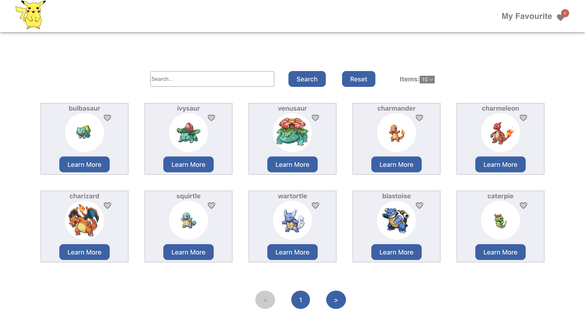

# Pokemon searcher

## 📝 Description

This dashboard is designed for families to track their medical appointments, monitor their medical expenses, and receive reminders to stay informed and organized. Users can conveniently compare their expenditures over time, manage upcoming appointments, and set reminders to ensure they stay up-to-date and never miss important events.

## 🛠️ Technology Stack

- React
- HTML
- CSS
- TypeScript 
- Tailwind

## 📜 Available Scripts

In the project directory, you can run:

### `npm start` ▶️

Runs the app in the development mode.\
Open [http://localhost:3000/](http://localhost:3000/) to view it in the browser.

### `testing deployment` ▶️

Open [https://precious-mochi-becaaa.netlify.app/]([https://precious-mochi-becaaa.netlify.app/](https://illustrious-lily-e1e57a.netlify.app/)) to view it in the browser.

## 🚀 Getting Started

To set up and run the project locally, follow these steps:

1. Clone the repository: `git@github.com:papryca/pokemon-api.git`
2. Navigate to the project directory: `cd pokemon-searcher`
3. Install dependencies: `npm install`
4. Start the development server: `npm start`

The application will open in your default browser, allowing you to explore and interact with it.

### `Screenshot`

